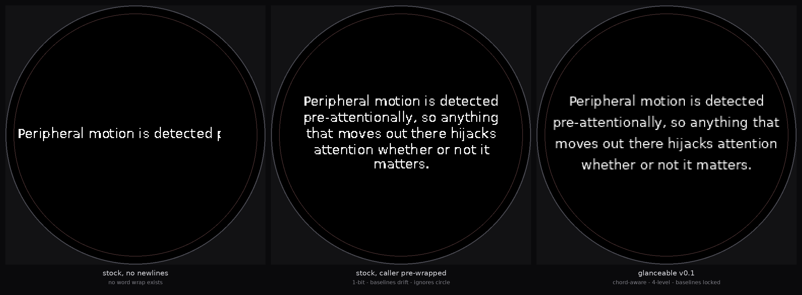

# glanceable

A layout and typography engine for round, glanceable near-eye displays.

Developed against Brilliant Labs Halo's 256×256 circular microOLED. Nothing
above `surface.py` contains a Halo-specific call.



## Why

The Brilliant SDK ships `TxTextSpriteBlock`, which rasterizes TTF text
host-side and sends it as sprites. The primitive is the right idea and is
under-specified.

**Fair comparison caveat:** stock's contract is that the *caller* pre-wraps and
passes `\n`. The middle panel above does exactly that, and it is perfectly
usable. The honest gap is narrower than "the SDK is broken" — measured on the
sample string at 13px, `glanceable` fits the same text in 4 lines instead of 5
and uses 16% more width (223px vs 193px), because the equator chord is 238px
while the largest inscribed rectangle is only 170px.

Verified against `brilliant-msg` 7.0.0:

| | stock | glanceable |
|---|---|---|
| word wrap | none — caller must pre-wrap; `width` merely sizes the scratch buffer, and no metrics are exposed to wrap *with* | greedy wrap, hyphenates over-wide words |
| line origin | each line cropped to its own ink bbox → baselines drift | single face-derived ascent → baselines exactly `line_height` apart |
| coverage | hard threshold `>127`, 1-bit | N-level quantization (default 4 of Halo's 16 palette entries) |
| bad font path | silent `load_default()`, `font_size` ignored | raises `FontLoadError` |
| overflow | clipped | surfaced in `Layout.leftover` |
| display shape | unaware — `TxPlainText` documents x:1-640, y:1-400 (Frame's panel) | chord-aware |

Nothing in the published SDK knows the display is round. Zero occurrences of
circle, radius, or a 256 display bound.

## The circular claim

On a round panel usable line width is a function of vertical position. Every
text engine ever written wraps to a rectangle, so apps either waste the middle
third of the glass or clip against the curve.

A line box is a rectangle, so it is constrained by whichever of its two
horizontal edges sits farther from the equator — **not** by its midpoint. Using
the midpoint is the intuitive move and it clips descenders near the poles.
`test_line_width_uses_narrow_edge_not_midpoint` pins this.

## Install

```bash
pip install -e ".[dev]"
pytest -q                      # 198 passed
python examples/compare.py     # regenerates docs/comparison.png
```

Core depends only on Pillow. The markdown renderer needs a CommonMark parser,
so it lives behind an extra:

```bash
pip install "glanceable[markdown]"    # adds markdown-it-py
```

## Use

```python
from glanceable import (Font, PILSurface, find_system_font,
                        ramp_palette, render_text)

surface = PILSurface(256, 256, ramp_palette(4))
layout = render_text(surface, Font(find_system_font(), 13), "…", levels=4)

if layout.truncated:
    ...  # paginate; never silently cut off
surface.to_rgb().save("frame.png")
```

Swap `PILSurface` for `SpriteSurface` to emit `TxSprite`-shaped payloads.

## Markdown

Markdown assumes a wide rectangular viewport and rich typography. A 256px circle
at a legible size gives roughly five to seven usable lines, the first and last
chord-narrowed. So most markdown syntax has to *degrade*, not render.

```python
from glanceable import HALO, Font, find_system_font
from glanceable.markdown import layout_markdown

page = layout_markdown(source, HALO, Font(find_system_font(), 13), page=0)

for line in page.lines:
    ...                          # line.run, line.kind, line.font
page.metadata.wikilinks          # [[Target]] retained for a caller to act on
page.metadata.dropped            # images, embeds, opaque fences — named, not lost
page.leftover_source             # hand back in to continue; no hidden cursor
```

Pagination is a discrete index and a pure function of its inputs — no cursor, no
scroll, no auto-advance. Every piece of source ends up in exactly one of three
places: on the glass, in `leftover_source`, or named in `metadata`.

Degradation policy, in brief: headings get one emphasis tier; bold and italic
drop their markup and keep the text (`Font` has no style axis to collapse *to*);
tables render as `header: cell` records, which is lossless at any column count
and degenerates to plain `key: value` at two; fenced code is never reflowed but
is broken at the chord with a visible continuation marker, in a rectangular
sub-viewport so it keeps one left edge; frontmatter is stripped before the
parser sees it. Full table in [core concepts](docs/core-concepts.md#markdown-degradation).

`examples/obsidian_bridge.py` renders notes from a vault directory to PNGs and
prints everything that did not reach the glass. It exists to run the renderer
against markdown written as notes rather than as test fixtures — it is evidence,
not a product, and nothing in `glanceable/` imports it:

```bash
python examples/obsidian_bridge.py --query chord
```

Retrieval is deliberately not implemented: `--query` is a fifteen-line substring
match, there to be deleted and replaced by an Obsidian MCP server or the Local
REST API plugin. `examples/vault/` is a committed corpus of deliberately ugly
notes — nested callouts, Dataview blocks, ragged tables, a 200-character token,
CJK, emoji, CRLF — and `tests/test_vault_corpus.py` asserts the three-way
guarantee over every one of them.

## Docs

- [Getting started](docs/getting-started.md)
- [Core concepts](docs/core-concepts.md) — display model, legibility rules
- [API reference](docs/api-reference.md)
- [Troubleshooting](docs/troubleshooting.md)
- [CLAUDE.md](CLAUDE.md) — constraints for contributors and AI assistants

## Status — v0.2, **never run on hardware**

Stated plainly because the point of this project is being the implementation
you can trust. 198 tests pass on Python 3.10, 3.12 and 3.14. All of them are
host-side; none of them is a device.

- **The device-agnostic boundary is untested.** `PILSurface` and `SpriteSurface`
  were written by one author against one mental model, which is not independent
  evidence that the `Surface` ABC is the right abstraction. Getting a second,
  non-Brilliant backend running is [roadmap item 1](ROADMAP.md#prove-the-bet)
  for exactly that reason — it is the claim this project most needs to test.
- `SpriteSurface` emits against published `brilliant_msg` 7.0.0 shapes but has
  **not** been round-tripped on a physical Halo. The wire format is unconfirmed.
- No device-side Lua counterpart yet: port the dirty-flag tree from
  CitizenOneX's `base_layout.lua` and validate against the emulator's PIL
  framebuffer.
- **CJK renders as tofu** with the default face. DejaVu Sans has no CJK glyphs;
  every missing character is reported in `metadata.unrenderable`, but you need a
  CJK-capable face to read it.
- `blit_coverage` writes palette indices rather than alpha-blending, so it is
  correct only over a background matching `palette_base`.
- Latin only. No BiDi, no shaping. CJK is *conserved* by the markdown renderer
  but broken on the wrong boundaries — there is no dictionary breaking.
- No glyph atlas caching; every run rasterizes fresh.
- `markdown.py` has no widow control: a heading or a single list item can strand
  alone at a page boundary.

## Deliberately omitted: animation

Peripheral motion detection is pre-attentional — anything that moves out there
hijacks attention involuntarily, whether or not it matters. Animation in a
glanceable-display toolkit encourages the exact failure mode the toolkit exists
to prevent. This is a design decision, not a missing feature.

## License

MIT. Layout-tree lineage credited to CitizenOneX on adoption.
